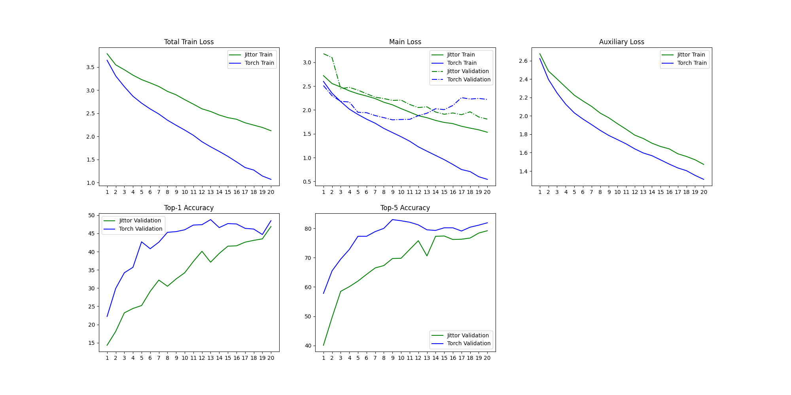
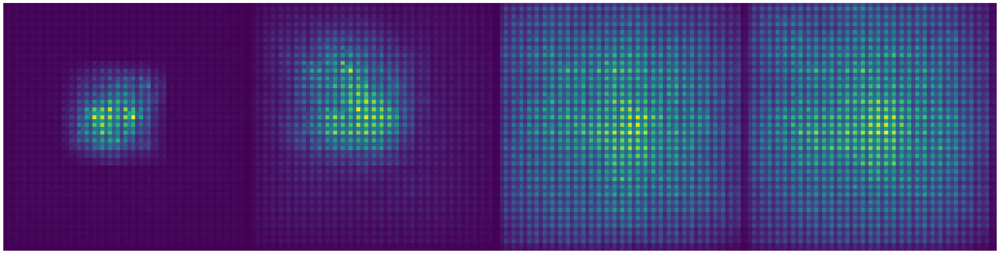
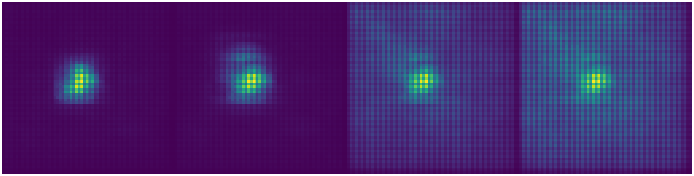

# Jittor-OverLoCK

本项目基于Jittor框架，对CVPR 2025的论文[OverLoCK](https://github.com/LMMMEng/OverLoCK)进行预训练环节的实验复现，并编写PyTorch版本的程序进行对齐实验。

## 环境配置

在Windows系统中，由于兼容性问题安装Jittor失败，所以安装了WSL Ubuntu 22.04.5用于实验。

安装了anaconda 3用于管理python环境。

Jittor的训练环境使用python 3.7，使用官网提供的安装命令：

```bash
python -m pip install jittor
python -m jittor.test.test_example
python -m jittor.test.test_cudnn_op
```

PyTorch的训练环境根据OverLoCK官方版本的实现配置：

```bash
# Environments:
cuda==12.1
python==3.10
# Dependencies:
pip install torch==2.3.1 torchvision==0.18.1 --index-url https://download.pytorch.org/whl/cu121
pip install natten==0.17.1+torch230cu121 -f https://shi-labs.com/natten/wheels/
pip install timm==0.6.12
pip install mmengine==0.2.0
```

由于`https://shi-labs.com/natten/wheels/`网络连接不佳，建议手动下载`natten`的`.whl`文件。


## 模型

由于计算资源有限，使用了一个比OverLoCK-XT更小规模的模型OverLoCK-XXT进行训练，参数配置如下：

```python
model = OverLoCK(
    depth = [1, 1, 2, 1],         
    sub_depth = [3, 1],              
    embed_dim = [24, 48, 96, 128],   
    kernel_size = [13, 11, 9, 7],      
    mlp_ratio = [2, 2, 2, 2],        
    sub_num_heads = [1, 2],          
    sub_mlp_ratio = [2, 2],
    projection = 256,               
    **kwargs
)
```


## 数据集

采用TinyImagenet数据集，它包含200个类别，训练集每个类别有500张图像，验证集每个类别有50张图像，尺寸均为64x64。由于计算资源和时间的限制，将类别序号按字典序排序后选出前20个类别进行训练和测试。


## 训练和测试

执行以下脚本，进行数据集加载、模型训练和验证集上的评估。

在Jittor环境中执行：

```bash 
python train.py
```

在PyTorch环境中执行：

```bash
python train_torch.py
```

## 结果和分析

在Jittor环境中执行：

```bash 
python plot.py
```

在PyTorch环境中执行：

```bash
python plot_torch.py
```

这两个程序根据两个版本的测试结果（`log.csv`和`log_torch.csv`）绘制出训练时损失函数和分类精度的变化曲线：



训练损失由主损失和辅助损失（均为交叉熵损失）相加得到，L = L(main) + α * L(aux)，其中根据OverLoCK原版实现取α=0.4。

在图中可看到，辅助损失（Auxiliary Loss）在两个版本的实现中的变化是高度一致的，这是因为它是经过OverLoCK模型中Base-net和Overview-net计算得到的结果，这两个子网络中模块的Jittor实现与PyTorch实现完全相同。

然而主损失的两个版本的实现差异较大。在第二张图（Main Loss）中，实线代表两个版本在训练时的主损失，虚线代表验证集上计算得到的损失（根据原版OverLoCK实现，验证时仅以Focus-net的输出计算主损失，无辅助损失）。从epoch 10开始，PyTorch版本的训练验证损失与训练主损失差距显著增大，造成明显的过拟合；Jittor版本则尚未出现过拟合，但损失下降速度明显比PyTorch版本更慢。由于时间限制，没有继续训练，但推测其损失会继续下降。

**精度曲线分析**：问题的关键在于Dynamic Block中使用的`na2d_av`算子的复现不够精确。OverLoCK模型中使用的`na2d_av`算子源自[Neighborhood Attention Transformer](https://github.com/SHI-Labs/Neighborhood-Attention-Transformer)的研究。原版OverLoCK实现使用的`na2d_av`算子来自第三方库NATTEN，它在NAT的研究基础上基于C++和CUDA做了高性能的底层实现。但由于实现过于复杂，本实验在编写Jittor版本时只根据NAT论文中的说明实现了朴素的邻域注意力计算，这可能使得计算原理上与NATTEN差异较大，导致表示能力弱于原版；即使有部分等价的计算效果，也可能因为与高度优化的计算图不一致而造成训练过程中优化问题地形的不同，收敛速度更慢。

后两张图是验证集上的Top-1和Top-5分类精度（百分数）。由于上述复现的差异，在训练过程的前半段，精度的差异较大；但是随着epoch的增大，两个版本的精度变得非常接近，这说明在给定的数据集和模型设置条件下，模型最终学习到的表示质量和泛化性能是一致的。最终的精度情况为：

|         | acc@1 | acc@5 |
| ------- | ----- | ----- |
| Jittor  | 0.469 | 0.792 |
| PyTorch | 0.485 | 0.819 |

Jittor训练总时长为259.2 min，PyTorch训练总时长为117.2 min，前者是后者的两倍多。除了计算框架本身的差异，造成Jittor训练缓慢可能的原因还有上述`na2d_av`算子的朴素实现造成更大的计算开销。

**可视化分析**：

有效感受野（Effective Reptive Field, ERF）。

根据[ERF的研究文章](https://arxiv.org/abs/1701.04128)，编写了有效感受野可视化的程序，分别在两个环境运行以下脚本：

```bash
python erf.py
```

```
python erf_torch.py
```

所得结果如下（第一行为Jittor，第二行为PyTorch，分别为第1,2阶段（basenet）与第3,4阶段（focusnet）末尾输出的中心位置神经元对应的输入图像上的梯度平均图，各处亮度表示输出对该处输入的梯度绝对值大小）。





分析：

- 整体上，可以看出，Jittor与PyTorch版本的可视化呈现出相似的模式，即阶段越靠后，有效感受野（图中明显更亮的部分）越大；第1,2阶段的亮斑局限在有限的范围内，而在第3,4阶段，除了中心有明显的亮斑以外，整张图片上都有更均匀分布的更亮的颜色。这是因为第3,4阶段中采用的ContMix模块将像素与全局的空间区域的注意力引入了卷积的计算，这使得中心神经元能够根据全局各处的输入计算其输出。
- Jittor与PyTorch版本还存在一定的差异：Jittor版本的亮斑更加地扩散、在3,4阶段的颜色更均匀，而PyTorch版本则更加集中。这与精度曲线中呈现的模型训练到的程度有一定关联：模型权重随机初始化，在训练开始时是充满噪声的，而在训练的过程中噪声逐渐由信息取代，Jittor的训练尚未达到最佳精度，处于欠拟合状态，而PyTorch的训练已经得到了充分的训练甚至于过拟合了，因而它对于最相关的局部的信息的利用最多，其梯度更大。

基于梯度的类别激活图（GradCAM）。


详细的训练日志见`log.txt`和`log_torch.txt`。

